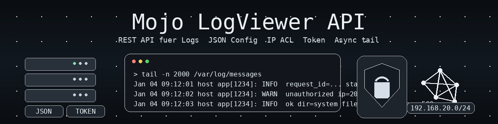

# Log Viewer REST API (Mojolicious)

Ein leichtgewichtiges, sicheres Log-Viewer-Backend auf Basis von **Mojolicious::Lite**.
Das Tool stellt Logdateien ueber eine REST-API zur Verfuegung und ist fuer den praxisnahen Admin-Einsatz gedacht.

Kein UI, kein Overengineering, klarer Fokus auf Sicherheit und Stabilitaet.

  

---

## Features

- REST API (JSON und Text)
- Anzeige mehrerer Logverzeichnisse
- Lesen einzelner Logdateien mit `tail`
- Limitierung der ausgelesenen Zeilen
- Asynchroner Tail-Aufruf via Subprocess
- IP-basierte Zugriffskontrolle (IPv4 CIDR)
- Optionaler API-Token (Header)
- Schutz gegen Directory Traversal
- UTF-8 saubere Ausgabe
- Sauberes Server-Logging

---

## Architektur

- Framework: Mojolicious::Lite
- Event Loop: Mojo::IOLoop
- Async Jobs: Mojo::IOLoop->subprocess
- Logging: Mojo::Log
- Konfiguration: JSON
- Authentisierung: IP ACL und optionaler Token
- Ausgabeformate: JSON und text/plain

Das Tool ist zustandslos und eignet sich fuer systemd-Services oder Container.

---

## Voraussetzungen

- Perl (empfohlen >= 5.20)
- Mojolicious

Verwendete Module:
- Mojolicious::Lite
- Mojo::Log
- Mojo::File
- Mojo::Promise
- Mojo::Util
- Mojo::JSON
- Mojo::Date

Keine externen Non-Core-Abhaengigkeiten.

---

## Installation

~~~bash
git clone https://github.com/<dein-user>/<repo>.git
cd <repo>
chmod +x app.pl
~~~

Falls Mojolicious noch fehlt:

~~~bash
cpanm Mojolicious
~~~

---

## Konfiguration

Die Konfiguration erfolgt ueber eine Datei `config.json` im gleichen Verzeichnis wie das Script.

### Beispiel `config.json`

~~~json
{
  "listen": "127.0.0.1:3000",
  "https": false,
  "ssl_cert_file": "",
  "ssl_key_file": "",
  "logfile": "/var/log/logviewer.log",

  "allowed_ips": [
    "127.0.0.1",
    "192.168.1.0/24"
  ],

  "logdirs": {
    "system": {
      "path": "/var/log"
    },
    "mail": {
      "path": "/var/log/mail"
    }
  }
}
~~~

### Hinweise zur Konfiguration

- Alle Logverzeichnisse werden beim Start aufgeloest (realpath)
- Symlinks werden konsequent abgelehnt
- Zugriff ausserhalb der definierten Logverzeichnisse ist nicht moeglich

---

## Sicherheit

### IP Zugriff (ACL)

Unterstuetzt:
- IPv4 Einzeladressen
- IPv4 CIDR Netze

IPv6 wird aktuell nur als Exact-Match unterstuetzt.

Wenn `allowed_ips` nicht gesetzt oder leer ist, ist der Zugriff nicht eingeschraenkt.

---

### API Token (optional)

Das API-Token wird ueber eine Environment Variable gesetzt:

~~~bash
export API_TOKEN="geheim"
~~~

Der Client muss den Header mitsenden:

~~~http
X-API-Token: geheim
~~~

Wenn kein Token gesetzt ist, erfolgt kein Token-Check.

---

## API Endpoints

### API Info

`GET /`

~~~json
{
  "info": "Log-Viewer REST-API",
  "version": "1.3",
  "api": [
    "/logdirs",
    "/log/:name",
    "/log/:name/*file?lines=2000"
  ]
}
~~~

---

### Logverzeichnisse auflisten

`GET /logdirs`

~~~json
{
  "ok": 1,
  "logdirs": [
    {
      "name": "system",
      "path": "/var/log"
    }
  ]
}
~~~

---

### Dateien eines Logverzeichnisses anzeigen

`GET /log/{name}`

~~~json
{
  "ok": 1,
  "dir": "system",
  "files": [
    "syslog",
    "messages",
    "auth.log"
  ]
}
~~~

---

### Logdatei lesen (Tail)

`GET /log/{name}/{file}?lines=2000`

Antwort:
- Content-Type: text/plain; charset=UTF-8
- Reiner Tail-Output der Datei

---

## Asynchrones Verhalten

Der Zugriff auf Logdateien erfolgt asynchron ueber
`Mojo::IOLoop->subprocess`.

Dadurch:
- blockieren keine Worker
- parallele Requests bleiben stabil
- auch groessere Logs sind unkritisch

Empfehlung:
> Bei vielen parallelen Zugriffen ist der asynchrone Tail-Aufruf sinnvoll.
> Fuer den normalen Admin-Betrieb ist die aktuelle Implementierung optimal.

---

## Fehlerverhalten

Alle Fehler werden konsistent als JSON zurueckgegeben:

~~~json
{
  "ok": 0,
  "error": "Fehlermeldung"
}
~~~

Verwendete HTTP Status Codes:
- 400 Bad Request
- 401 Unauthorized
- 403 Forbidden
- 404 Not Found
- 500 Internal Server Error

---

## Logging

- Logging erfolgt ueber Mojo::Log
- Logfile wird in `config.json` definiert
- Sicherheitsrelevante Ereignisse werden explizit geloggt

---

## Betrieb mit systemd (Beispiel)

~~~ini
[Unit]
Description=Log Viewer REST API
After=network.target

[Service]
ExecStart=/usr/bin/perl /opt/logviewer/logviewer-agent.pl
WorkingDirectory=/opt/logviewer
Restart=always
Environment=API_TOKEN=geheim

[Install]
WantedBy=multi-user.target
~~~

---

## Lizenz

MIT License

Copyright (c) 2026

Permission is hereby granted, free of charge, to any person obtaining a copy
of this software and associated documentation files (the "Software"), to deal
in the Software without restriction, including without limitation the rights
to use, copy, modify, merge, publish, distribute, sublicense, and/or sell
copies of the Software, and to permit persons to whom the Software is
furnished to do so, subject to the following conditions:

The above copyright notice and this permission notice shall be included in
all copies or substantial portions of the Software.

THE SOFTWARE IS PROVIDED "AS IS", WITHOUT WARRANTY OF ANY KIND.
